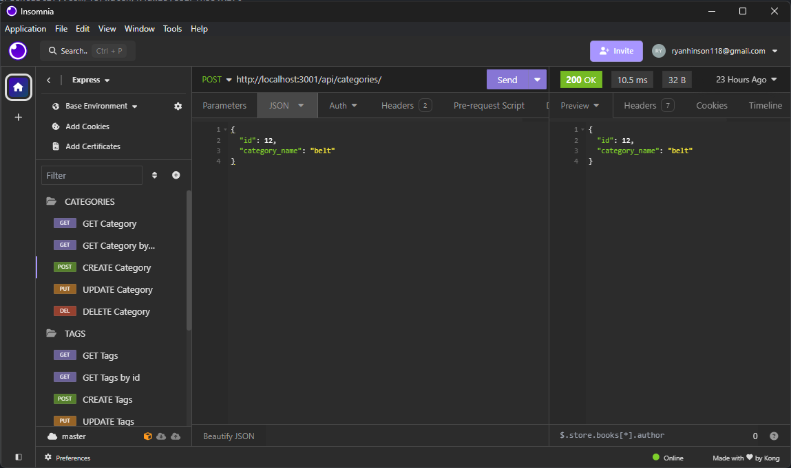
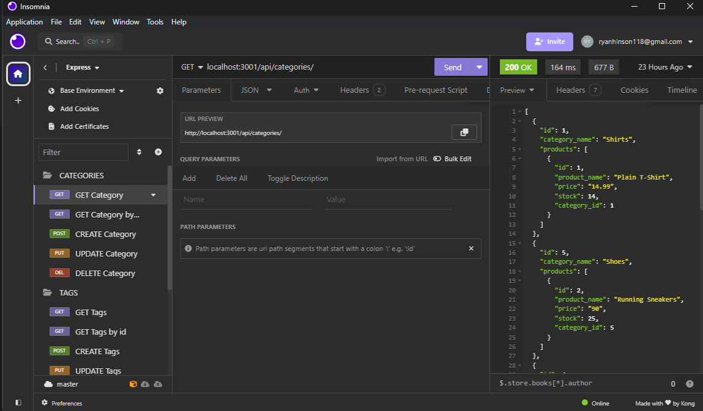
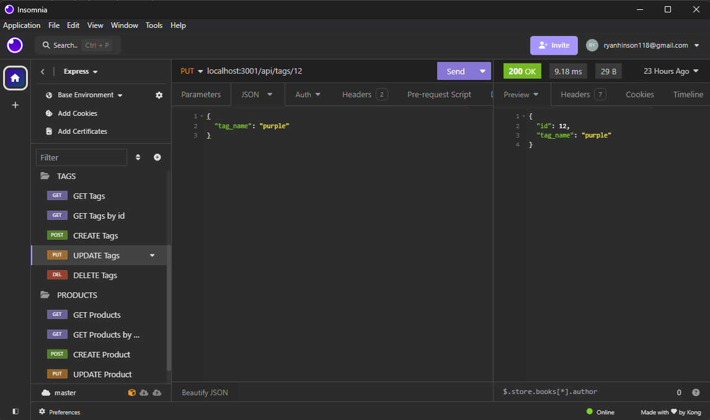
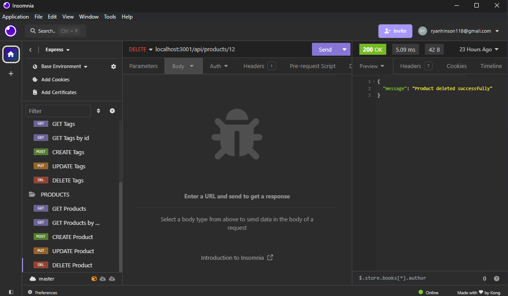

# E_Commerce

## Description

I was motivated in this challenge to make a back end with new technology for a E commerce website. The goal I wanted to complete was to GET all data from categories, products, and tags as well as to get single reviews. I also wanted to UPDATE and DELETE from categories, products, and tags using Insomnia to test it. I learned how to store sensitive info for my postgres login by using a dotenv file. I also learned how to use Insomnia to test my routes and see if they work and how models and routes can work together.

## Website Link

https://app.screencastify.com/v3/watch/N4awI3ye8iPYn55vXl70
          
## Installation
npm install
          
npm run seed

node index.js

## Usage

  

          
## Questions
If you have any questions or need further clarification, you can reach me at [ryanhinson118@gmail.com](mailto:ryanhinson118@gmail.com) or visit my GitHub profile at [https://github.com/RyanH118](https://github.com/RyanH118).